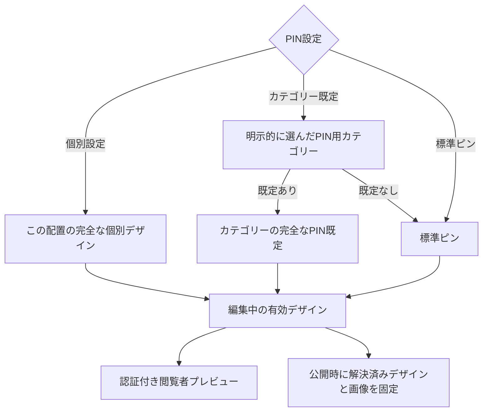

# Category / PIN ownership and resolution

Decisions D1–D4. Evidence: [01 E1/E5/E8–E10](01-CURRENT-WORKFLOW.md).

## Model evaluation

| Model | Aquarium/exhibit | Restaurant with 飲食 + 休憩 | Retail custom brand / event exception | Future same Content on two Floors | Verdict |
|---|---|---|---|---|---|
| A Category determines all appearance | Efficient uniform styling | Ambiguous unless new winner rule | Cannot preserve exceptions | Assumes all placements identical | Reject mandatory control. |
| B Independent Spot appearance | Repeats common design | Unambiguous | Strong | Content storage becomes ambiguous | Preserve as individual mode, insufficient default workflow. |
| C Placement appearance | Correct spatial ownership | Still needs source policy | Strong | Naturally supports different placements | Adopt ownership, not a new entity in WU-65. |
| D Separate visual classification | Reusable style system | Separates meaning cleanly | Strong | Flexible | A second taxonomy is unnecessary for six demonstrated groups; defer. |
| E Category default + explicit override | Group maintenance plus exceptions | Explicit visual Category chooses source | Legacy/brand override remains stable | Source and override can move to Placement | **Choose E, with C's ownership boundary.** |

A Category classifies Content for search/filter/meaning. Its **Category icon** represents that classification in filter/legend contexts. Its optional **PIN default** supplies a full marker design to placements that explicitly elect to use it. These are distinct outputs, not a promise that changing a legend icon repaints a Map.

Categories screen labels: `カテゴリーアイコン（絞り込み・凡例）` and `このカテゴリーを使うピンの既定デザイン`. Show separate previews. A user may explicitly copy a compatible Category icon into the PIN draft once; this is not a live second inheritance chain. Do not auto-copy existing icons during migration or on later icon edits. Custom icons use authorized MediaAsset references.

## Resolution contract

Conceptual fields below describe a future implementation, not a Prisma migration in this task.

- Category: optional complete default tuple (type, preset or image asset/legacy URL, color, size), plus revision for optimistic concurrency.
- Current Spot: source mode `standard | category | individual`; nullable `pinStyleCategoryId`; existing explicit PIN tuple. The source FK must refer to a Category assigned to this Spot in this Map. `importance` is independent and never inherited or overwritten by a style command.
- Source selection and explicit tuple are **placement appearance metadata** despite their temporary location on Spot. No additional PIN/Placement table or Content entity now.
- Standard style is the existing built-in ●, terracotta `#C7401F`, medium. No new configurable Map-default layer. Its visual contract must remain stable; changing that baseline later is a separate reviewed migration.

The whole tuple comes from one source. Editing one color in an inherited PIN opens an individual draft initialized from the effective whole style. Saving switches the whole PIN to individual mode; it does not create a property-by-property cascade. Type-specific rendering stays current: illustration ignores any base/color that the renderer does not use. Preserve tuple values for compatibility.

## Creation and explicit adoption

Ordinary new Spot creation and CSV import start with **標準ピン**, target off. Classification alone never elects visual policy. In a single creation form, the operator may explicitly choose a PIN source; default selection is standard. Structured imports use one post-import **PINの設定元を変更** command for many Spots.

That command offers:

1. `各スポットの1つだけのカテゴリーを使う`: preview the exact source for every selected single-category Spot; require all selected rows to have exactly one membership. Multi/zero-category rows are listed as ineligible, not guessed or silently skipped. Operator can explicitly narrow to the shown eligible subset before applying.
2. `指定したカテゴリーを使う`: choose one Category that belongs to every target Spot. No implicit membership addition. Resolve differing groups in separate commands.
3. `標準ピンを使う`: explicit reset to baseline, preview consequences.
4. `今の見た目を個別設定として保持`: resolve now and freeze the full tuple, including asset reference, then change mode. This is also the escape path before removing a source category.

Selecting a source whose default is absent is allowed and displays `カテゴリー既定：展示（既定未設定のため標準ピン）`. Setting that default later will update these inherited PINs; the adoption preview says so. No automatic inheritance occurs just because the record has exactly one category. This extra group-level command preserves ownership without 37 detail visits.

## Multiple Categories

Restaurant memberships remain **飲食 + 休憩**, source **飲食**, with optional individual override. Visitor filtering still matches either category. Reordering categories or changing their display priority changes neither source nor PIN. Adding a new membership never changes source. A zero-category Spot can use standard or individual mode. A multi-category Spot without a visual choice remains standard (new) or individual (legacy), and is not blocked from publication.

Reject first-category precedence even when server ordering is deterministic: changing a display order must not repaint a marker. Reject a category-wide priority rule because its effect is distributed and hard to review. Reject “primary Category” as a semantic restriction: the source is specifically visual, not the Spot's one true classification.

## Transitions, deletion and Save

| Event | Exact result |
|---|---|
| Save Category PIN default | Changes all category-mode LIVE PINs selecting it; leaves standard/individual modes untouched. Show affected count, grouped Floors, before/after samples and link to affected list. Save warns that visitor output changes only after publishing. |
| Change Category name/icon/order | Name updates source label; icon/order have no PIN effect. Membership/OR filter semantics remain. |
| Change chosen PIN Category | Effective style changes after source Save; never copies old default. Must be same-Map membership. |
| Add semantic Category | Membership changes; source unchanged. |
| Remove membership used as source | Block before mutation with affected rows. First choose another existing member source, standard, or freeze individual. No auto-switch to remaining category. Applies to form, CSV, bulk, revisions and Category delete. |
| Delete a referenced Category | Block while any source references remain, including individual records retaining it for reset. Offer affected-list link; clear/change sources explicitly, then retry deletion. No silent cascade. |
| Remove a Category PIN default | Reviewed default change to absent; inherited records fall back to standard, with affected preview. For preserving appearance, freeze affected PINs first. |
| Customize inherited PIN | Draft whole effective tuple; `個別設定として保存` commits tuple and mode together. Failed Save retains draft. |
| Reset individual with retained valid source | `カテゴリー既定に戻す：飲食` previews **current** default, not historical copied values. Explicit Save changes mode. |
| Reset individual without source | Choose a member Category or `標準ピンに戻す`. Never infer from order. |
| Source removed while individual | Explicitly clear/change retained reset target; individual tuple stays unchanged. |

UI always shows effective thumbnail plus `標準ピン`, `カテゴリー既定：飲食`, or `個別設定`. In individual mode, retained reset target appears in the reset action, not as an active source badge. Selecting a mode is a draft, not immediate persistence. Category edit, PIN visual edit and bulk review are separate Save/command boundaries; source draft navigation uses existing guards.

Default edits must revalidate Category revision and the affected set before saving. If scope has changed since preview, report conflict and re-review. All Spot source writers check Spot version and Category/membership state. Update dependent live versions or equivalent dependency tokens so pending revisions and stale inspectors cannot overwrite a changed visual basis. Use one resolver for admin marker, list thumbnail, authenticated preview and release building; no independent client precedence logic.

## Content / Placement room

Today `Spot = content + one placement`. Tomorrow a Content object can supply shared name/text/photos/categories to Placements A/B. Move floorId, x/y, source selector and explicit tuple to Placement. Each placement can elect the same Category default or use a Floor-specific exception without rewriting Content. Do not promise that changing future Content membership can bypass source-reference checks; it must report affected placements. WU-65 does not design multi-Floor duplication or a new Content-level visual cascade.

## Visitor and Paper boundaries

Resolve LIVE appearance before producing the current PublicSpot shape. Public release creation writes concrete PIN fields and copied images; old releases never dereference live Category defaults. Public visitor component/marker layout, category OR filtering and AQUA-007 remain unchanged. Authenticated Preview resolves the same LIVE styles but remains no-store/authenticated and respects target + x/y eligibility.

Paper eventually should receive all semantic categories (identity/name/order/Category icon), optional explicit visual source identity, effective PIN style, source provenance, Floor/placement identity and source release context. Grouping/legend semantics must use memberships, not selected PIN source; a legend icon need not equal a spatial marker. Current editorial card first-category badge is not endorsed as a semantic primary category. WU-65 changes neither Paper templates nor grouping; test that shared resolved DTOs preserve historical PUBLISHED output and intended LIVE source differences.
