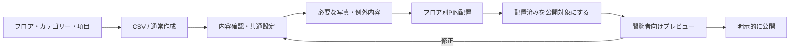

# Initial setup and returning-operator flow

Decision D8: **no dedicated setup Wizard**. Use existing Category, Floor, CSV, List, Media and PIN routes with a task strip and contextual return links. Evidence: [01](01-CURRENT-WORKFLOW.md). No stored setup stage, duplicated forms or completion entity.

## Initial 30–50 Spot sequence

1. **Prepare the Map:** register Floors/illustrations and Categories; choose enabled fields once. For Aquarium this is five Floors and six Categories, not 37 repeated settings. Category defaults can be configured now or later before adoption. Do not make categories/photos mandatory for every Map.
2. **Import → resolve:** prepare the current v3 starter or export existing rows; enter structured Spot values, Floor names and categories. Preview row diffs, fix unknown/ambiguous names and conflicts, then import once. New records are unplaced and target-excluded. An operator with fewer records can use normal Spot New instead; no forced CSV.
3. **Apply shared policies:** filter/select records; repair any missing classification through ADD; assign coordinate-free records to intended Floors if necessary. Adopt Category defaults in one reviewed sole-category command and separate multi-category groups. New records otherwise use standard pins. No need to open each Detail.
4. **Enrich selectively:** photo counts/missing-photo filter identify candidates, but the operator chooses only Spots that benefit. Use row photo action, choose/reorder images for one named Spot, then return to the same filtered list. Exceptional text may use Detail or a second CSV pass. Do not require 37 photos when only three useful images exist.
5. **Place floor by floor:** enter PIN Editor with Floor and queued unplaced Spots, effective styles already visible. Choose first, click visual position, explicitly save-and-next. Repeat 37 spatial decisions in five sessions; skip uncertain locations. Do not automatically switch Floors or save a guessed position.
6. **Review eligibility:** return to positioned target-excluded list. Select the reviewed subset and `公開対象にする`. Unplaced Spots cannot pass this command. A Spot with no photo/category can still be an intentional release candidate. Preview shows eligible saved content only.
7. **Visitor Preview → Publish:** use WU-64 authenticated visitor Preview and review all Floors. If correct, operator uses existing explicit Publish flow in a future live task. WU-65 neither publishes nor redesigns visitor appearance. Category/default changes affect the editable preview, not an existing release, until Publish.

These are tasks, not locked steps. Photo work can occur after placement. Categories/defaults can be revisited during maintenance. Show the next useful task based on saved data and filters, not a persisted “step 4 complete” flag. Avoid a universal mandatory sequence of Categories → Media that would exclude legitimate zero-category/no-photo Maps.

## Returning operators

- New exhibit: create/import only new records, adopt a source as a group if appropriate, place on its Floor, mark the reviewed additions as targets, Preview and Publish.
- Shared icon/color revision: edit one Category PIN default; review affected inherited count/Floors and exempt individual PINs; Save, Preview, Publish. No 37-detail maintenance sweep.
- Restaurant newly categorized as rest area: ADD 休憩; visual source 飲食 stays unchanged. If desired, explicitly change source separately.
- Seasonal closure: target off for selected Spots, then Publish to update visitor output. Reopening uses target-on for still-positioned Spots. No date-based automation invented here.
- Incorrect Floor before placement: batch assign only fully coordinate-free target-excluded records. After placement, spatial corrections remain individual.
- Resume tomorrow: recompute remaining unplaced/target-excluded/photos-none from saved state; filtered route context resumes the task without a separate setup session.

## Media integration

Keep Media as a reusable library and SpotPhoto as an ordered association. Add a list row `写真を編集` contextual panel using the existing manager; this is per-Spot inline work, not bulk. Label the target Spot prominently, make selection's “add to this Spot” consequence explicit, and show association success separately from upload success. Existing upload persists a reusable asset even if the operator closes the panel; say so where needed. Do not imply Cancel deletes the asset.

Expose recent/all and `すべての用途` so unused uploads are discoverable. No new media search engine is needed for the three-photo case. Duplicate filenames must not become matching keys. Preserve maximum six photos and representative-first order. Adding/removing/reordering is a named immediate command; do not put these commands under an unrelated Spot-form Save. Busy-lock target changes; retain the panel on error; count updates only after server success. Bulk photo assignment is deferred because shared imagery can misdescribe distinct exhibits and the UAT provides no repeated-photo use case.

## PIN Editor improvement

Keep current unplaced filter, Floor retention, positioned search, visual draft modes and request-context guards. Add an explicit `このフロアの未配置を続けて配置` entry and queue count; order by stable name + ID, not updatedAt, so saves do not reshuffle the queue.

- Queue entry selects the first unplaced Spot and enters placement mode visibly; display Spot name, Floor and effective source/thumbnail before a candidate exists.
- `この位置を保存して次へ` saves only the displayed candidate's x/y. Advance only after success/reconciliation, refresh authoritative remaining rows, preserve Floor/camera, select the next unplaced row in this session's stable ordering and announce its name. This is opt-in continuous operation, not global automatic save/advance.
- Normal `この位置を保存` remains available and follows existing behavior. Design Save does not advance the placement queue. Styling exceptions use a separate mode with explicit return.
- `後で配置` skips without writing; retain skipped IDs in session ordering and summarize them at Floor end. Never call skipped “done”. Reload rebuilds from persisted unplaced state; no lost-work promise for session-only order.
- On failure stay on current Spot/candidate; on concurrent placement/deletion refresh and report it before advancing. Never send a response for old Spot/Floor into the newly selected inspector.
- Floor end says `このフロアの配置を確認` and gives an explicit next-Floor action; no surprise floor switch. Switching with a candidate uses the existing dirty guard.
- Keyboard: retain combobox arrows/Enter and Escape; standard Tab then Enter/Space can invoke the named save-and-next button. Focus moves to announced next-item controls, not an invisible canvas target. No global Enter-to-save while typing or during Japanese IME composition. Extra shortcuts are not needed for this slice.

PIN placement remains a visual human decision plus an explicit persistence boundary. The reduction is repeated searching/mode setup and inspector styling, not automatic coordinate generation.
