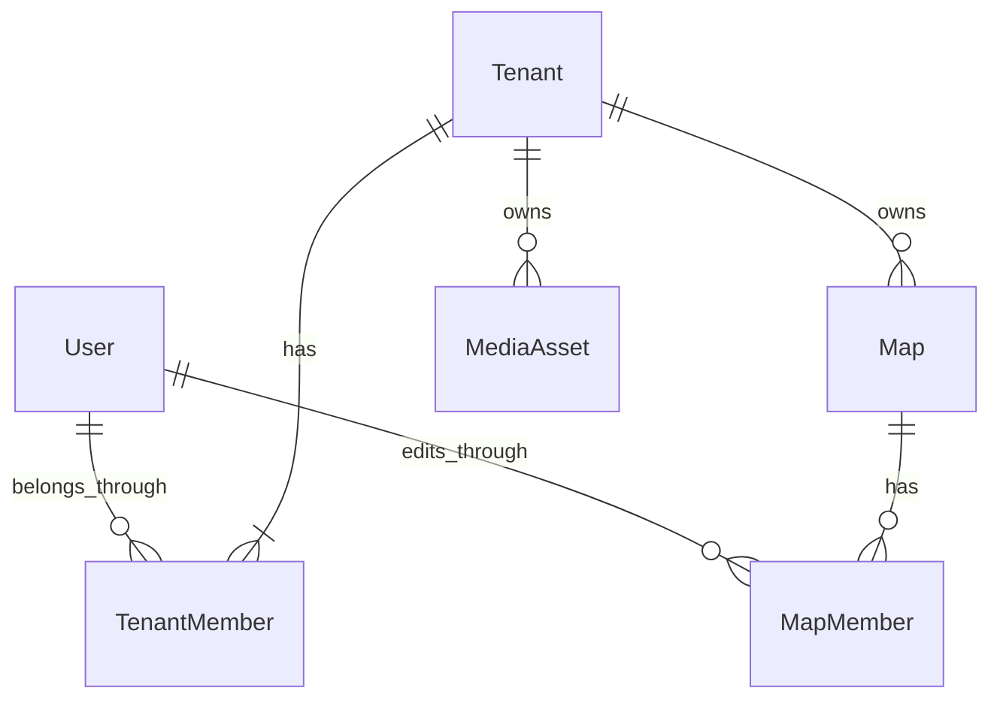

# KAN-52 Organization / Map-scoped RBAC

## Domain model

`Tenant` is the internal name for an organization. UI copy uses 「組織」. TenantMember OWNER grants inherited access to every Map in that Tenant; Owner MapMember rows are neither created nor required. TenantMember MEMBER has no map access by itself. MapMember EDITOR grants edit/publish access to that one Map. A User may have TenantMember rows in multiple Tenants and MapMember rows for multiple Maps.

MapMember assignment is validated in the service layer: its User must already be a TenantMember of the Map's Tenant. Removing a TenantMember removes that User's MapMember rows in the same Tenant transactionally and preserves the User account.

## Permission matrix

| Action | Owner | Assigned Map Editor | Unassigned Member |
|---|:---:|:---:|:---:|
| Organization settings read/edit | Yes | No | No |
| Member management / role changes | Yes | No | No |
| Create Map | Yes | No | No |
| List visible Maps | All | Assigned | None |
| Read/edit/publish assigned Map | Yes | Yes | No |
| Delete Map | Yes | No | No |
| Floor, Spot, Category, Field, CSV, PIN, Georef, Decoration | Yes | Assigned map | No |
| Media Library read/upload | Yes | Yes | No |
| Attach Tenant media to assigned Map | Yes | Yes | No |
| Physical Media delete | Yes | No | No |
| Map Editor assignment | Yes | No | No |

The database must always retain at least one OWNER per Tenant. Demoting or removing the last Owner returns conflict. Self-demotion/removal uses the same rule and is allowed only when another Owner remains.

## Deferred work

- Invitation Email: KAN-69
- Account lifecycle and password reset: KAN-56
- Spot Editor assignment and approval: KAN-53
- Audit Log: KAN-54
- Self-service onboarding: KAN-70

None of the deferred workflows are implemented by KAN-52.
